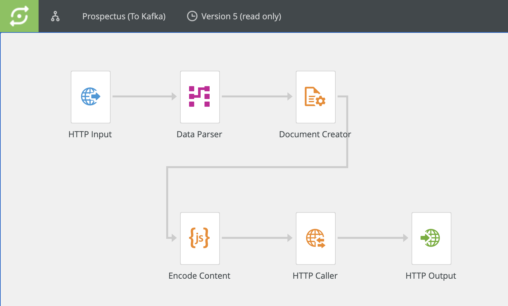
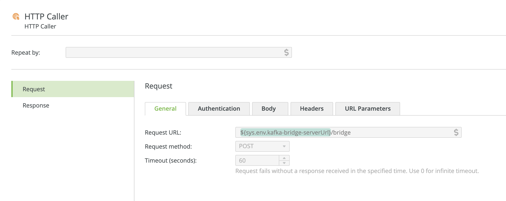
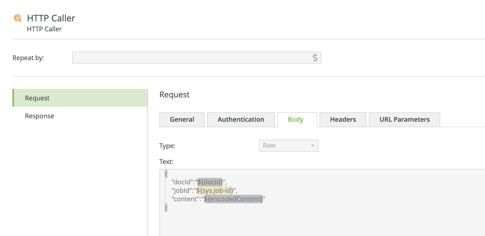

# Inspire Scaler to Apache Kafka Demo

This project is a simple proof-of-concept by which content generated by [Inspire Scaler](https://www.quadient.com/experience/omnichannel-communications-interactions/inspire-platform) is sent to [Apache Kafka](https://kafka.apache.org) via [Apache Camel](https://camel.apache.org).


## Getting Started

### Prerequisites _(WIP)_

  * Kafka installation

### Scaler Configuration _(WIP)_

* Workflow
  
  

  * Document Creator component sends output to the `spool` custom variable (default)
  
  * Script component base64-encodes the output and stores it in the `encodedContent` custom variable 
  
    ```javascript
    setvar("encodedContent", base64.encode(getvarBytes("spool")))
    ```

* HTTP Caller Component - Request Tab

  

* HTTP Caller Component - Body Tab
  
  


### Application Configuration

* Set appropriate values in `src/main/resources/application.yaml`
* `kafka2file` route included in `src/main/resources/camel/routes.xml` is optional (will read messages sent to the Kafka topic and dump them to file for diagnostic purposes)


### Running the Application

```
./gradlew bootRun
```

[](https://asciinema.org/a/XCHkS6Jpasf6nHUTXw1EMmB3y)


## Roadmap

See the [open issues](https://github.com/robertwtucker/scaler2kafka-demo/issues) for a list of proposed features (and known issues).


## Contributing

Contributions are what make the open source community such an amazing place to be learn, inspire, and create. Any contributions you make are **greatly appreciated**.

1. Fork the Project
2. Create your Feature Branch (`git checkout -b feature/AmazingFeature`)
3. Commit your Changes (`git commit -m 'Add some AmazingFeature'`)
4. Push to the Branch (`git push origin feature/AmazingFeature`)
5. Open a Pull Request

## License
Copyright (c) 2021 Quadient Group AG and distributed under the MIT License. See `LICENSE` for more information.

## Contact
Robert Tucker - [@robertwtucker](https://twitter.com/robertwtucker)

Project Link: [https://github.com/robertwtucker/scaler2kafka-demo](https://github.com/robertwtucker/scaler2kafka-demo)

## Acknowledgements

* [Quadient Inspire](https://www.quadient.com/experience/omnichannel-communications-interactions/inspire-platform)
* [Spring Boot](https://spring.io/projects/spring-boot)
* [Apache Kafka](https://kafka.apache.org)
* [Apache Camel](https://camel.apache.org)
